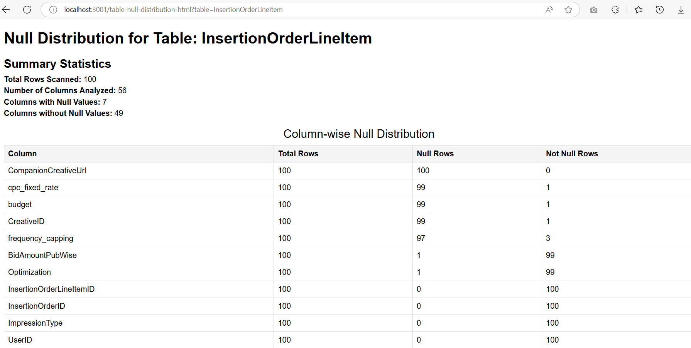

# Node.js Null Distribution Analyzer

This Node.js project analyzes the null distribution of columns in a specified database table. It exposes APIs to retrieve the null distribution in both JSON and HTML formats. The application is configurable through a `.env` file.

## Features

- Calculates the distribution of null values for each column.
- Sorts columns by the number of null values in descending order.
- Intelligently limits the no_of_rows to be scanned, configurable via `DEFAULT_LIMIT`
- Outputs results in JSON or HTML format.
- Fully customizable via `.env` file.

## Requirements

- Node.js (v14 or higher)
- A relational database (only mysql for now)

## Installation

1. Clone the repository:

   ```bash
   git clone https://github.com/rahulbansalc6414/nodejs-null-distribution-utility
   cd your-repo-name
   ```

2. Install dependencies:

   ```bash
   npm install
   ```

3. Create a .env file by copying the provided example:

   ```bash
   cp .env.example .env
   ```

4. Update the .env file with your database credentials and desired configuration:

   ```bash
   DB_HOST=your-database-host
   DB_USER=your-database-username
   DB_PASSWORD=your-database-password
   DB_NAME=your-database-name
   DEFAULT_LIMIT=100
   PORT=3000
   ```

5. Start the server
   ```bash
   node app.js
   ```

## Endpoints

### GET /table-null-distribution

Fetches the null distribution of a specified table in JSON format.

**Query Parameters:**

- `table` (required): The name of the table to analyze.
- `limit` (optional): The number of rows to fetch. Defaults to the value specified in the `.env` file.

**Example Request:**

```bash
curl "http://localhost:3000/table-null-distribution?table=your_table_name&limit=50"
```

**Example Response:**

```json
{
  "table": "your_table_name",
  "limit": 50,
  "summary": {
    "total_rows_scanned": 50,
    "no_of_columns_analyzed": 2,
    "no_of_columns_having_null_values": 2,
    "no_of_columns_having_no_nulls": 0
  },
  "null_distribution": {
    "column1": {
      "total_rows": 50,
      "null_rows": 10,
      "not_null_rows": 40
    },
    "column2": {
      "total_rows": 50,
      "null_rows": 5,
      "not_null_rows": 45
    }
  }
}
```

### GET /table-null-distribution-html

Fetches the null distribution of a specified table in HTML format.

**Query Parameters:**

- `table` (required): The name of the table to analyze.
- `limit` (optional): The number of rows to fetch. Defaults to the value specified in the `.env` file.

**Example Request:**

```bash
curl "http://localhost:3000/table-null-distribution-html?table=your_table_name&limit=50"
```

This will render an HTML page displaying the null distribution of the specified table.

## Example Output

Below is an example of the HTML output generated by the application:



This shows the summary statistics and null distribution displayed in a user-friendly table format.
